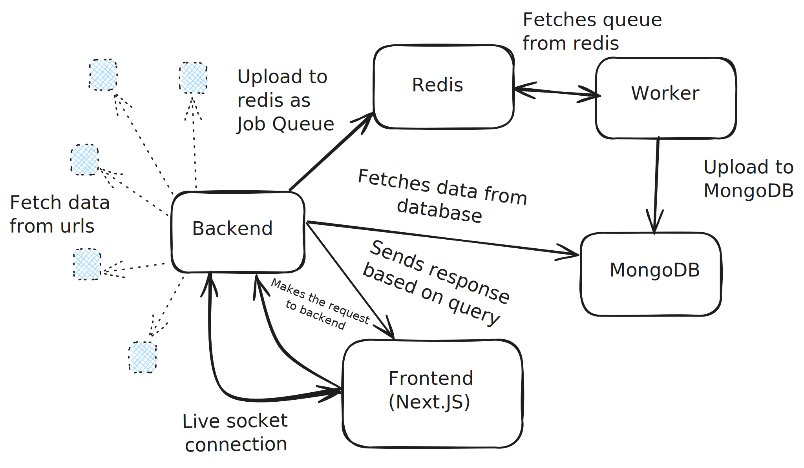

# Architecture Overview

## 📖 Project Overview

This system imports job feeds from multiple external APIs on a schedule, processes them with validation and deduplication, and stores them in MongoDB. The frontend provides real-time and historical views of job imports.

## 🧩 Key Components

- **Frontend (Next.js)**: Client-side app deployed on Vercel, displays import history and system status with live updates using Socket.IO.
- **Backend API (Node.js + Express)**: REST API deployed on Cloud Run, provides endpoints for import history, integrates Socket.IO for real-time updates.
- **Fetcher Script**: Fetches feeds from configured URLs, parses jobs, and enqueues them to Redis.
- **BullMQ Queue (Redis)**: Used to queue job import tasks for asynchronous processing.
- **Worker (Node.js)**: Consumes jobs from the Redis queue, inserts or updates jobs in MongoDB, tracks import stats.
- **MongoDB**: Stores import logs and job data.
- **Cloud Run Jobs + Cloud Scheduler**: Automate periodic execution of the fetcher/worker to keep data updated.

## 🔄 Data Flow

1. **Scheduler** → triggers Cloud Run Job (worker) on a cron schedule.
2. **Worker** → fetches job feeds from multiple APIs.
3. **Queue** → BullMQ in Redis queues each job item.
4. **Worker process** → consumes jobs from queue, performs validation, saves results to MongoDB.
5. **API** → serves import history data to the frontend.
6. **Socket.IO** → emits real-time updates to the frontend.
7. **Frontend** → polls API and listens for socket events to update the UI.

## 🌐 Architecture Diagram

```plaintext
[Cloud Scheduler] --> [Cloud Run Job (worker)]
                            |
                            v
                      [Fetch feeds]
                            |
                            v
                      [Redis queue]
                            |
                            v
                    [Worker consumes]
                            |
                            v
                       [MongoDB]
                            |
                            v
              [Express API on Cloud Run]
                            |
                            v
                [Next.js Frontend (Vercel)]

```



## 🛠 Design Decisions

- **Cloud Run** for API server and worker: scales automatically, fully managed, no need to manage VMs.
- **Cloud Run Jobs + Cloud Scheduler**: perfect for scheduled tasks; avoids always-on worker costs.
- **Redis with BullMQ**: robust queuing solution, supports scaling multiple workers.
- **MongoDB**: flexible schema, ideal for storing varied job feed data.
- **Next.js App Router on Vercel**: modern frontend stack with server components, optimized for React 19.
- **Socket.IO**: enables real-time UI updates on job status and import progress.
- **GitHub + Cloud Build**: automatic build & deploy pipeline for API server.

## 📈 Scalability & Flexibility

- Adding new feeds: extend fetcher config to include new API URLs.
- Scaling workers: run multiple Cloud Run Job executions or add more queue workers.
- Resilience: Redis queue decouples fetcher from worker, reducing impact of API failures.
- Flexibility: frontend and backend are independently deployable; environment variables configure connections.

## 🚀 Deployment & Automation

- Frontend is deployed on Vercel with automatic rebuilds on GitHub pushes.
- Backend uses Cloud Build to build images on every commit to `/server`, with continuous deployment to Cloud Run.
- Worker runs as a Cloud Run Job, scheduled with Cloud Scheduler directly through the Cloud Run console for fully automated periodic executions.

## ✅ Summary

This architecture ensures:

- Minimal operational overhead with serverless services.
- Flexible, scalable, and maintainable design.
- Clear separation of concerns between frontend, API, and worker processes.

```

```
